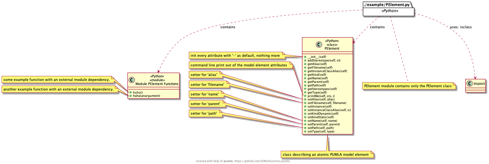
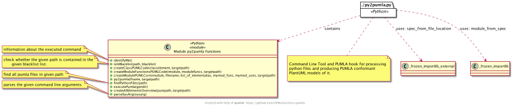

# py2pumla
Analyses source code of python implementations (files, classes, modules) and creates pumla architecture elements (re-usable PlantUML).

In concrete, py2pumla does:
- scan a path recursively and find all python implementation files
- generate architecture PlantUML/pumla diagrams for the pyhton source code
  showing the implementation elements and their dependencies.
  
---

## Example

Execute from the `py2pumla` home directory the following command to 
generate the PlantUML pumla files:

`python3 py2pumla.py ./example`

for the following example Python file:
[./example/PElement.py](./example/PElement.py)

This file represents a Python module, therefore the following
re-usable pumla file gets generated:

[./example/_generated_p2p_pumla/pelementModule.puml](./example/_generated_p2p_pumla/pelementModule.puml)

The file contains 2 functions and one class definition.

For the functions part the following re-usable pumla file gets generated:
[./example/_generated_p2p_pumla/PElementModFuncs.puml](./example/_generated_p2p_pumla/PElementModFuncs.puml)

And for the class definition this re-usable pumla file gets generated:
[./example/_generated_p2p_pumla/pelementClass.puml](./example/_generated_p2p_pumla/pelementClass.puml)

Furthermore, the following overview on the module is generated:
[./example/_generated_p2p_pumla/allElementsOverview.puml](./example/_generated_p2p_pumla/allElementsOverview.puml)

... which leads to this nice overview diagram:

## Eat your own dogfood - py2pumla architecture overview

This overview was generated by executing

`python3 py2pumla.py ./`

in `py2pumla`'s home directory.

---
# `pumla`

See here for a reference to pumla:

https://github.com/DrMarkusVoss/pumla

